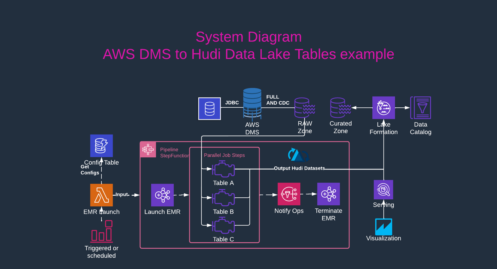

# aws-dms-to-hudi
Example AWS DMS ingestion pipeline to Apache Hudi tables in S3

   

# Deployment    
Resources are deployed using Cloudformation, some prerequisites are required first.

## Prerequisites   

* The source system is expected to be an RDBMS of type mysql | oracle | postgres | mariadb | aurora | aurora-postgresql | sqlserver 
* [Follow the docs and make sure the RDBMS and replication user are configured properly](https://docs.aws.amazon.com/dms/latest/userguide/CHAP_Source.html)
* This stack reads from a SecretsManager secret (that you create prior to deploying this solution. The Secret should be formatted as such:
    ```
    {
        "username": "<username>",
        "password": "<password>",
        "engine": "<mysql | oracle | postgres | mariadb | aurora | aurora-postgresql | sqlserver>",
        "host": "<db hostname>",
        "port": <db port>,
        "dbname": "<db name>"
    }
    ```   
* Two private vpc subnets are required in order to run AWS DMS and Amazon EMR resources, these subnets should have connectivity to the database server
* **Lake Formation** If you are looking to use Lake Formation, make sure you have first configured it through the UI:
  * [LakeFormation Admin permissions configured](https://catalog.us-east-1.prod.workshops.aws/v2/workshops/78572df7-d2ee-4f78-b698-7cafdb55135d/en-US/lakeformation-basics/datalake-administrator)
  * Otherwise, set UseLakeFormation to FALSE

## Deploying the stack

* Fire up the AWS Console, then [click this link](https://console.aws.amazon.com/cloudformation/home?region=us-east-1#/stacks/quickcreate?templateUrl=https%3A%2F%2Faws-dms-to-hudi-example.s3.amazonaws.com%2Fartifacts%2Faws-dms-to-hudi.yaml&stackName=dms-to-hudi)
* Change the stack name if you'd like
  * **NOTE**: In general, the AWS resources are dynamically named based on the stack name and logical resource name 
* Set the parameters, some parameters are required:
  * `DatabaseSecret`: as mentioned above, this is an AWS Secrets Manager secret path eg: `mydatabase/mysecret` that contains the necessary database information
  * `VpcSubnetIds`: as mentioned above, the private subnets for the data infrastructure (AWS DMS and EMR), eg `subnet-aaaaaaaa,subnet-bbbbbbbb`
  * Please review the remaining parameters, be sure to understand them and then set them according to your use case
* Check the Transforms and Capabilities:
  * I acknowledge that AWS CloudFormation might create IAM resources.
  * I acknowledge that AWS CloudFormation might create IAM resources with custom names.
  * I acknowledge that AWS CloudFormation might require the following capability: CAPABILITY_AUTO_EXPAND
* Deploy as a Change set or just click "Create Stack" based on your preference
  
## Minimizing costs    
The main costs behind this stack will be the running AWS DMS Replication instance and the recurring Amazon EMR incremental processing jobs.    

### AWS DMS Costs   
In order to keep costs to a minimum, the template parameter `CreateReplicationTask` is set to `FALSE` by default. 
Setting this to true will deploy an AWS DMS replication instance using the instance type specified in `ReplicationInstanceClass`.
It is recommended to initially deploy this stack with `CreateReplicationTask` set to `FALSE`, and then update the stack with it set to `TRUE` once everything else is successfully deployed and you are ready to begin testing.   

### Amazon EMR Costs   
The EMR costs will be directly related to the `IncrementalSchedule` parameter, as well as how you configure the cluster shape and size in the DynamoDB Config table.
By default, the IncrementalLoad scheduled in [EventBridge Rules](https://us-east-1.console.aws.amazon.com/events/home?region=us-east-1#/rules) is disabled. This will need to be enabled manually when ready.

## Configuring the Amazon EMR pipelines    
The Amazon EMR pipeline configuration is stored in the DynamoDB resource `ConfigTable` created as part of this stack.   
By default example rows are loaded into this table for your reference. This can be disabled by setting `DeployExampleConfigs` to `FALSE`

## DynamoDB Config Table documentation    
Please see [the config table documentation](docs/config_table.md) for complete config table item information and schema

### Example: Adding your own configurations to the config table

Here is an example of configuring the initial load, incremental pipeline and a single table using a file example.json

```
cat example.json
{
  "Configs": [
    {
      "config": "pipeline::hudi_bulk_insert",
      "identifier": "hammerdb",
      "allowed_concurrent": false,
      "emr_config": {
        "release_label": "emr-6.7.0",
        "master": {
          "instance_type": "m5.xlarge"
        },
        "worker": {
          "count": "1",
          "instance_type": "r5.xlarge"
        },
        "step_parallelism": "1"
      }
    },
    {
      "config": "pipeline::hudi_delta",
      "identifier": "hammerdb",
      "allowed_concurrent": false,
      "emr_config": {
        "release_label": "emr-6.7.0",
        "master": {
          "instance_type": "m5.xlarge"
        },
        "worker": {
          "count": "1",
          "instance_type": "r5.xlarge"
        },
        "step_parallelism": "1"
      }
    },
    {
      "config": "table::public.customer",
      "identifier": "hammerdb",
      "hudi_config": {
        "record_key": "c_w_id,c_d_id,c_id",
        "source_ordering_field": "trx_seq",
        "is_partitioned": false
      },
      "enabled": true
    }
  ]
}
aws lambda invoke --function-name test-cfn-dms-PipelineConfigLambda-WwWgymxyKOEX --payload fileb://example.json out.txt
```

# Operating the system    
Once deployed, take the following steps to get going:

1. Kick off the AWS DMS Replication task, once it is complete and in continuous replication mode, proceed to the next step
2. Launch the bulk insert hudi jobs in order to create the initial tables
   * ```
     cat example.json
     {
        "Identifier": "hammerdb",
        "PipelineType": "hudi_bulk_insert"
     }
     aws lambda invoke --function-name <LaunchEmrPipelineLambda name> --payload fileb://example.json out.txt
     ```
3. Monitor the [EmrStepFunction](https://us-east-1.console.aws.amazon.com/states/home?region=us-east-1#/statemachines) until completion
4. OPTIONAL: [Subscribe your email address to the SNS topic](https://us-east-1.console.aws.amazon.com/sns/v3/home?region=us-east-1#/subscriptions) created, this will receive notifications when steps succeed/fail
5. Once the bulk insert job is complete, enable the IncrementalLoadSchedule in [EventBridge](https://us-east-1.console.aws.amazon.com/events/home?region=us-east-1#/rules)
6. Enjoy! :)
